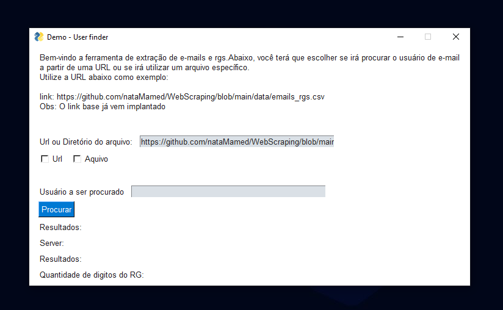
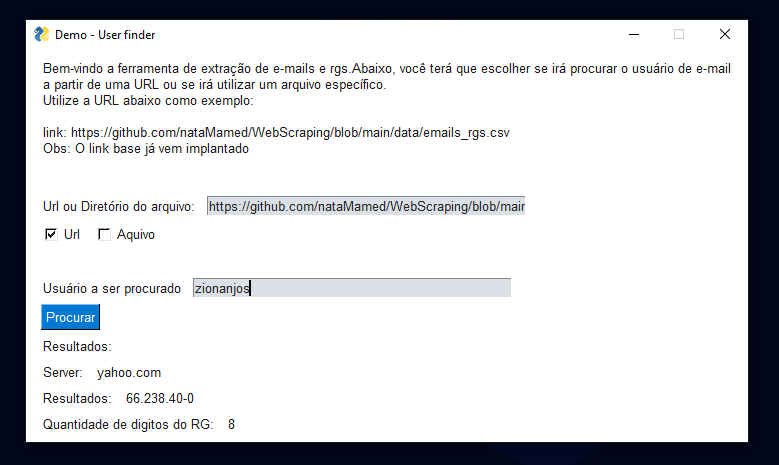

# User Finder



Link com os arquivos do projeto: [Natã Mamede](https://github.com/nataMamed/WebScraping)

## 🌌Background:

Imagine que você quer checar se um cliente específico está presente nas ordens de solicitação enviadas  da empresa a qual você trabalha, porém você só tem em mãos o nome de usuário do e-mail dele e como são diversos e-mails liberados na solicitação o trabalho para procurar seria enorme. Além disso, se o cliente estiver presente na solicitação você necessita de outros dados do cliente como o server do e-mail, o Rg e a quantidade de dígitos do Rg, os quais serão obtidos do banco de dados.

Para resolver esse trabalho braçal surge o app desenvolvido. O *User Finder* recebe uma URL da pagina com os e-mails ou um diretório onde os e-mails estão armazenados. Com base nessa entrada do usuário ele irá verificar se o cliente específico a ser procurado existe na pagina web ou no arquivo selecionado. Se existir, o app consultará o banco de dados para trazer o resto das informações necessárias. **

---

## 💻Developing Process

A primeira etapa de desenvolvimento foi gerar dados de e-mails e Rg's para formar a base fictícia de dados. Para isso, peguei do google nomes, sobrenomes e os servers mais utilizados para criar os e-mails transformei em arquivos e realizei os tratamentos e adições necessárias, as quais podem ser vistas com os scripts na pasta *random_data,* até chegar no resultado dentro da pasta *data*.

A segunda parte consistiu em criar um extrator de emails utilizando expressões regulares e a biblioteca requests. Após comprovar o seu funcionamento, o terceiro passo foi extrair, com base em um email específico, as outras informações necessárias (Rg, Server, Quantidade de dígitos do Rg) utlizando a biblioteca pandas. Finalmente, o quarto passo foi dedicado a criação de uma interface, utilizando a biblioteca [PySimpleGUI](https://pysimplegui.readthedocs.io/en/latest/), para facilitar o uso do usuário. O resultado foi como se pode ver na primeira imagem.

---

## 🔧How to setup the enviroment

Para configurar é fácil, basta seguir os seguintes passos:

- Baixar o arquivo .zip e extrai-lo para o local de interesse
- Abrir a pasta, crirar um ambiente virtual com:
 ```python
python -m venv .env
```
- Após isso, instalar todas sas dependencias do projeto com:
 ```python
pip install -r requests.txt
```
- Pronto, agora insira a linha de código abaixo e o programa irá rodar:
 ```python
python app.py
```

---

## 🖖How to use

Ao abrir o app, a caixa de url já virá preenchida com a pagina web do meu GitHub, a qual possui os e-mails e rgs aleatórios gerados para teste,  basta então você marcar que irá extrair de uma url e inserir o nome do usuário procurado, você pode utilizar os nomes que estão [nesse link](https://github.com/nataMamed/WebScraping/blob/main/data/emails_rgs.csv). Exemplo de preenchimento:

                      *Os resultados são exibidos quando o botão procurar for pressionado*
